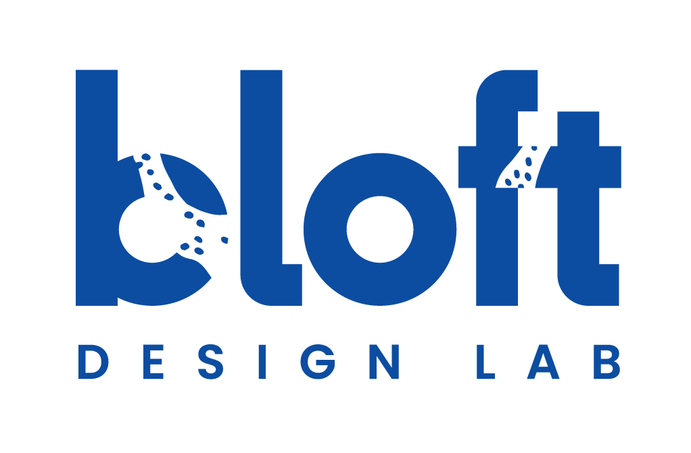

<!--
*** Thanks for checking out the Best-README-Template. If you have a suggestion
*** that would make this better, please fork the repo and create a pull request
*** or simply open an issue with the tag "enhancement".
*** Thanks again! Now go create something AMAZING! :D
***
***
***
*** To avoid retyping too much info. Do a search and replace for the following:
*** github_username, repo_name, twitter_handle, email, project_title, project_description
-->


<!-- PROJECT SHIELDS -->
<!--
*** I'm using markdown "reference style" links for readability.
*** Reference links are enclosed in brackets [ ] instead of parentheses ( ).
*** See the bottom of this document for the declaration of the reference variables
*** for contributors-url, forks-url, etc. This is an optional, concise syntax you may use.
*** https://www.markdownguide.org/basic-syntax/#reference-style-links
-->
[![Contributors][contributors-shield]][contributors-url]
[![Forks][forks-shield]][forks-url]
[![Stargazers][stars-shield]][stars-url]
[![Issues][issues-shield]][issues-url]
[![MIT License][license-shield]][license-url]
[![LinkedIn][linkedin-shield]][linkedin-url]


<!-- PROJECT LOGO -->
<br />
<p align="center">
  <a href="https://github.com/Bloft-Design-Lab/Bad-Ass-Pellet-Extruder/">
    
  </a>

  <h3 align="center">Bad Ass Pellet Extruder</h3>

  <p align="center">
    A Hangprinter compatible pellet extruder for large scale FGF-printing.
    <br />
    <a href="https://github.com/Bloft-Design-Lab/Bad-Ass-Pellet-Extruder/"><strong>Explore the docs »</strong></a>
    <br />
    <br />
    <a href="https://github.com/Bloft-Design-Lab/Bad-Ass-Pellet-Extruder/">View Demo</a>
    ·
    <a href="https://github.com/Bloft-Design-Lab/Bad-Ass-Pellet-Extruder/issues">Report Bug</a>
    ·
    <a href="https://github.com/Bloft-Design-Lab/Bad-Ass-Pellet-Extruder/issues">Request Feature</a>
  </p>
</p>


<!-- TABLE OF CONTENTS -->
<details open="open">
  <summary><h2 style="display: inline-block">Table of Contents</h2></summary>
  <ol>
    <li>
      <a href="#about-the-project">About The Project</a>
    </li>
    <li>
      <a href="#design-drivers">Design Drivers</a>
      <ul>
        <li><a href="#prerequisites">Prerequisites</a></li>
        <li><a href="#installation">Installation</a></li>
      </ul>
    </li>
    <li><a href="#usage">Usage</a></li>
    <li><a href="#roadmap">Roadmap</a></li>
    <li><a href="#contributing">Contributing</a></li>
    <li><a href="#license">License</a></li>
    <li><a href="#contact">Contact</a></li>
    <li><a href="#acknowledgements">Acknowledgements</a></li>
  </ol>
</details>


<!-- ABOUT THE PROJECT -->
## About The Project

[![Product Name Screen Shot][product-screenshot]](https://example.com)

The Hangprinter project by Torbjørn Ludvigsen has developed a promising and affordable concept for a large scale cable-driven 3D-printer, that has the potential to serve as the framework for an entirely new class of 3D-printers, enabling distributed local manufacturing of large end use products like furniture, vehicles, buildings etc. Up until now the Hangprinter has relied on regular FDM-extruders leaving the project far behind its true potential. Being great for desktop printers, those extruders are not suitable for printers beyond the 1 cubic meter class. Filament extrusion hits the wall in terms of speed, cost and sustainability.

We decided to circumvent this obstacle by developing an affordable pellet extruder, that enables you to print not only with industry standard plastic pellets, but also and mainly with re-granlute plastic made from your plastic waste.

Here's a blank template to get started:
**To avoid retyping too much info. Do a search and replace with your text editor for the following:**
`github_username`, `repo_name`, `twitter_handle`, `email`, `project_title`, `project_description`

<!-- DESIGN DRIVERS -->
## Design Drivers

* Throughput 1-2 kg/hr depending on polymer
* As light as possible
* Nozzle sizes up to 10 mm, easy to swap
* Sturdy base for attachment
* Enough heating power to cover as many polymers as possible
* Tolerance for potential foreign objects (dirt, sand, etc.) within the granulate
* Automatic material transport and dispensing
* High flow cooling for the print area

### Prerequisites

This is an example of how to list things you need to use the software and how to install them.
* npm
  ```sh
  npm install npm@latest -g
  ```

## Benchmark

* Dyze Design Pulsar
* Mahor XYZ v4
* Precious Plastic Extruder

### Installation

1. Clone the repo
   ```sh
   git clone https://github.com/github_username/repo_name.git
   ```
2. Install NPM packages
   ```sh
   npm install
   ```


<!-- USAGE EXAMPLES -->
## Usage

Use this space to show useful examples of how a project can be used. Additional screenshots, code examples and demos work well in this space. You may also link to more resources.

_For more examples, please refer to the [Documentation](https://example.com)_


<!-- ROADMAP -->
## Roadmap

See the [open issues](https://github.com/github_username/repo_name/issues) for a list of proposed features (and known issues).


<!-- CONTRIBUTING -->
## Contributing

Contributions are what make the open source community such an amazing place to be learn, inspire, and create. Any contributions you make are **greatly appreciated**.

1. Fork the Project
2. Create your Feature Branch (`git checkout -b feature/AmazingFeature`)
3. Commit your Changes (`git commit -m 'Add some AmazingFeature'`)
4. Push to the Branch (`git push origin feature/AmazingFeature`)
5. Open a Pull Request


<!-- LICENSE -->
## License

Distributed under the MIT License. See `LICENSE` for more information.


<!-- CONTACT -->
## Contact

Your Name - [@twitter_handle](https://twitter.com/twitter_handle) - email

Project Link: [https://github.com/github_username/repo_name](https://github.com/github_username/repo_name)


<!-- ACKNOWLEDGEMENTS -->
## Acknowledgements

* []()
* []()
* []()


<!-- MARKDOWN LINKS & IMAGES -->
<!-- https://www.markdownguide.org/basic-syntax/#reference-style-links -->
[contributors-shield]: https://img.shields.io/github/contributors/Bloft-Design-Lab/Bad-Ass-Pellet-Extruder.svg?style=for-the-badge
[contributors-url]: https://github.com/Bloft-Design-Lab/Bad-Ass-Pellet-Extruder/graphs/contributors
[forks-shield]: https://img.shields.io/github/forks/Bloft-Design-Lab/Bad-Ass-Pellet-Extruder.svg?style=for-the-badge
[forks-url]: https://github.com/Bloft-Design-Lab/Bad-Ass-Pellet-Extruder/network/members
[stars-shield]: https://img.shields.io/github/stars/Bloft-Design-Lab/Bad-Ass-Pellet-Extruder.svg?style=for-the-badge
[stars-url]: https://github.com/Bloft-Design-Lab/Bad-Ass-Pellet-Extruder/stargazers
[issues-shield]: https://img.shields.io/github/issues/Bloft-Design-Lab/Bad-Ass-Pellet-Extruder.svg?style=for-the-badge
[issues-url]: https://github.com/Bloft-Design-Lab/Bad-Ass-Pellet-Extruder/issues
[license-shield]: https://img.shields.io/github/license/Bloft-Design-Lab/Bad-Ass-Pellet-Extruder.svg?style=for-the-badge
[license-url]: https://github.com/Bloft-Design-Lab/Bad-Ass-Pellet-Extruder/blob/main/LICENSE.txt
[linkedin-shield]: https://img.shields.io/badge/-LinkedIn-black.svg?style=for-the-badge&logo=linkedin&colorB=555
[linkedin-url]: https://linkedin.com/company/bloft-design-lab
